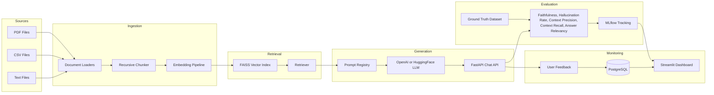

# Architecture

## Data Flow

1. Source documents are loaded from PDFs, CSVs, and text files.
2. Documents are normalized, checksummed, and split into overlapping chunks.
3. Embeddings are generated with OpenAI, HuggingFace Transformers, or deterministic hashing for local runs.
4. Chunks and vectors are written to a FAISS index.
5. FastAPI retrieves top-k chunks, renders a governed prompt, calls the selected LLM, and returns source-cited answers.
6. Evaluation jobs compare generated answers against validated ground truth and log metrics to MLflow.
7. Streamlit displays quality metrics, hallucination trends, latency, feedback, and prompt comparisons.
